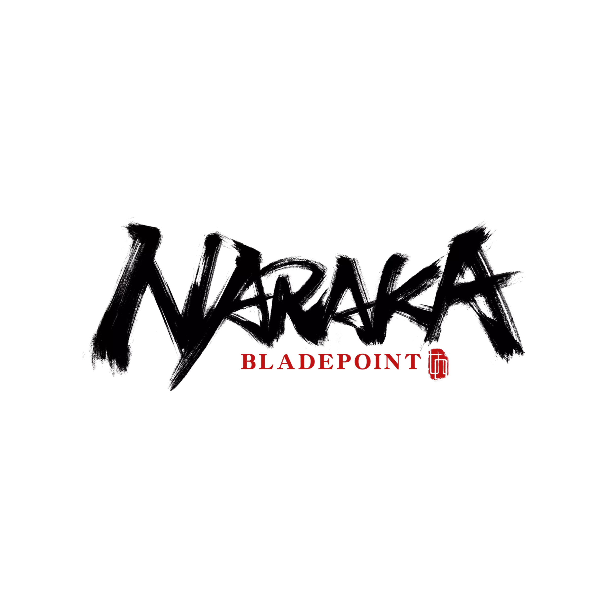

  

<h3 align="center">
   Hello 👋, my name is Thatcher :full_moon_with_face:
</h3>

I am a self-taught front-end developer. Before going to college to earn my Bachelor degree I have been self-taught the fundamentals of HTML, CSS and JavaScript. I spent most of my free time browsing on YouTube finding cool projects to work on to further enhance my personal GitHub and portfolio. Freecodecamp, codecademy and The Odin Project are my go to sites to get self-certified. I switch back and forth toward learning a new programming language, library and working on projects.

### Let's connect :selfie:

### Languages and Tools I use :magic_wand:

 
 
 

#### During my spare time, I also play games, these are some games I am currently playing

<!--
**Th5tch3r/Th5tch3r** is a ✨ _special_ ✨ repository because its `README.md` (this file) appears on your GitHub profile.

Here are some ideas to get you started:

- 🔭 I’m currently working on ...
- 🌱 I’m currently learning ...
- 👯 I’m looking to collaborate on ...
- 🤔 I’m looking for help with ...
- 💬 Ask me about ...
- 📫 How to reach me: ...
- 😄 Pronouns: ...
- ⚡ Fun fact: ...
-->
